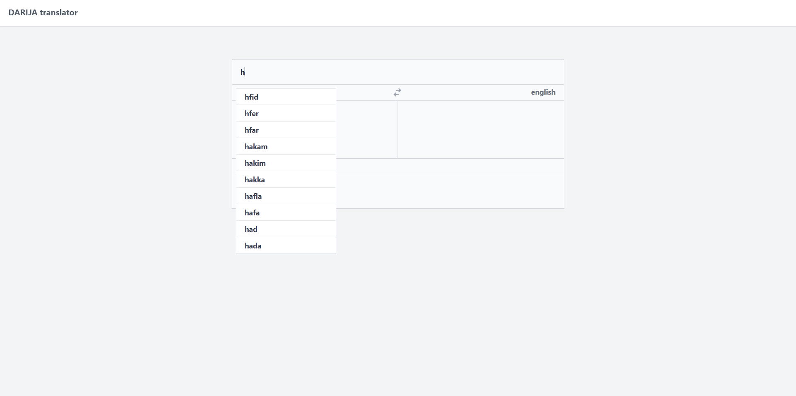
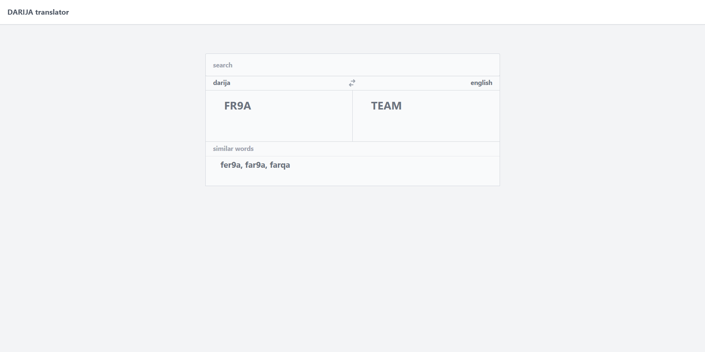

# darija_translator
A fun little project i did using the [darija_open_dataset](https://github.com/darija-open-dataset/dataset)
for translating the Moroccans main language (Darija) to english

features:
- fast auto completion using Tries(prefix trees).
- various categories with more than 10000 words.


### screenshots



## installation
### the api
run
```sh
$ cd api
$ pip install -r requirements.txt
$ python -B main.py
```

<br>

### front-end
run
```sh
$ cd front-end
$ npm install
$ npm run dev
```

<br>

## tech
- [darija_open_dataset](https://github.com/darija-open-dataset/dataset)
- [FastApi](https://github.com/tiangolo/fastapi)
- [ReactJs](https://github.com/facebook/react)

